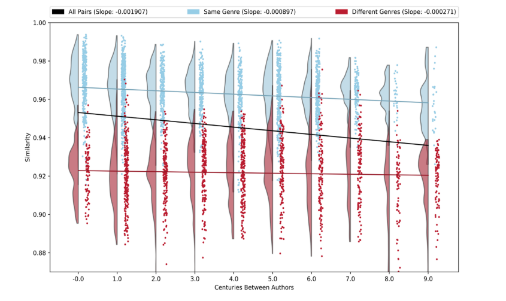
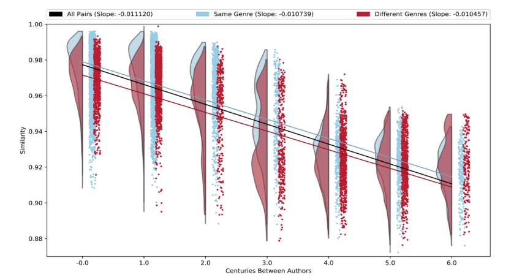
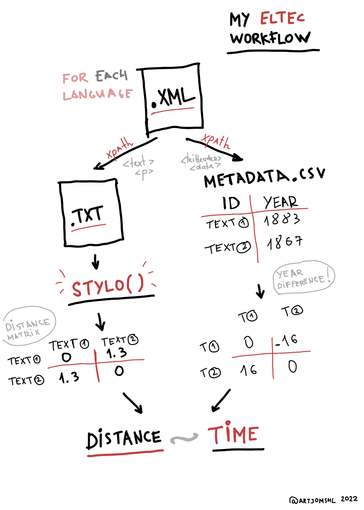

```{r setup, include=FALSE}
library(tidyverse)
knitr::opts_chunk$set(echo = TRUE,eval=TRUE)
theme_set(theme_minimal())


```

## Author similarity across time

In a [recent work](https://culturalanalytics.org/article/13680-like-two-pis-in-a-pod-author-similarity-across-time-in-the-ancient-greek-corpus), Storey & Mimno have shown that Ancient Greek literature almost did not change stylistically across centuries, when compared to Islandic or English. They have measured how stylometric distances between authors differ across time (see figure below). Compare Ancient Greek trends across large century spans:  



And English (Middle and Modern):  




In this quick showcase we will mimick this study with few corpora in ELTeC collection. First, to demonstrate the building blocks and the pipeline of the experiment, we focus on two languages:  `r emo::ji("uk")` [English](https://github.com/COST-ELTeC/ELTeC-eng) and `r emo::ji("germany")` [German](https://github.com/COST-ELTeC/ELTeC-deu). We also don't focus on authors, but on the individual texts, since ELTeC's timespan is limited and there cannot be more than 3 novels per author (often there is just 1 novel per author).

Let's look at what we will need for this:

1. Metadata with the first edition of the novel (good approximation of when the text was written), novel's id and language. All this information now sits in `metadata.tsv` file - it's just a tab-separated table which you can open in Excel, Open Office, etc. We grab metadata directly from .xml files, see `00_preparations.R` script for details.

2. Distance tables: we allow `stylo()` to do the heavy-lifting and directly use results in further analysis

3. For `stylo` to work, text should be plain, no header information included. Plain texts already sit in `plain_corpus/` folder, with folder for each language. See `00_preparations.R` for details of grabbing plain texts from .csv

Below is full schematized workflow:



## Setting things up

We start at loading necessary libraries, reading metadata, filtering metadata by languages.


```{r housekeeping,message=F}
# libraries
library(stylo)
library(tidyverse)
## if you do not have tidyverse for R, istall it (it might take a while!) using following function:
## install.packages("tidyverse")

## this is 'BottleRocket2' palette from 'wesanderson' collection
## check 'paletteer' package for more amazing palettes
pal1 <- c("#FAD510FF", "#CB2314FF", "#273046FF", "#354823FF", "#1E1E1EFF")

## read metadata table (by default in the same working directory as this notebook)

meta = read_tsv("metadata.tsv")

meta_en = meta %>% filter(lang=="en") %>% arrange(id)
meta_de = meta %>% filter(lang=="de") %>% arrange(id)

```

### A note about pipes

As you see we are using weird `%>%` operator here. It is called **a pipe** and is part of the `tidy` R principles and programming framework. Its function is to *pipe* outcome of the previous function or variable into the next one, which eases the reading of code and continuous manipulations with data, e.g. tables. Compare:

```{r}
## One way to make function operate on the output of another function is "nesting"

# here sqrt() works on the output of sum() which takes the output of c() which collects three values in one vector
sqrt(sum(c(8,4,4)))

## Another way is pipes that you can 'read' from top to bottom:
c(8,4,4) %>% 
  sum() %>% 
  sqrt()

```


## Powering up stylo()

You can run `stylo()` function without the user interface or the dendrogram output, directly controlling its behavior with *attributes*. We are interested only in distance tables. We assign the output of `stylo()` function to variables, to use distance tables later.

Note: the easiest way to look at what attributes *can be* fed to `stylo()` check `stylo_config.txt` 

```{r stylo,message=F}
## English corpus
eng=stylo(gui=F, # turn off user interface
          corpus.dir = "plain_corpus/ENG/", # manual path to the corpus
          mfw.min=200, # setting most frequent words
          mfw.max=200, 
          analyzed.features = "w", # our features will be words
          ngram.size = 1, # single words, to be specific
          distance.measure = "delta", # Burrows' Delta distance
          sampling = "no.sampling", # no sampling
          sample.size = 10000, # but you can play with it later
          display.on.screen = FALSE, # turn off plot
          corpus.lang="Other") # setting language to `other` means stylo() won't assume any language and just cut words by whitespaces

## German corpus
de=stylo(gui=F,
         corpus.dir = "plain_corpus/DEU/",
         mfw.min=200,
         mfw.max=200,
         analyzed.features = "w",
         ngram.size = 1,
         distance.measure = "delta",
         sampling = "no.sampling",
         sample.size = 10000,
         display.on.screen = FALSE,
         corpus.lang="Other")
```

### Distance tables

Now we have quite a lot of info from `stylo()` sitting in the variables `de` and `eng`.
To explore what is inside, you can use `summary()`.

```{r}
summary(eng)
```

Parts of complex objects can accessed in R via `$` operator. That is how we get to distance tables.

```{r}
## distance table from stylo results
distances_en <- eng$distance.table %>%
  as.matrix() # convert to base R matrix object

distances_de <- de$distance.table %>% 
  as.matrix() # convert to base R matrix object


```

Distance matrix is a square matrix where the distance between each novel and any other novel is recorded. Hence, this matrix is symmetric across diagonal and the diagonal will is 0. Why? Because a distance from me to myself is 0 (it is the same point, at least geometrically). Look at the small part of the top left corner:

```{r}
## here we use indexing of 2D objects (rows and columns) with [] to subset matrix
## the part before comma selects rows, after - columns
## 1:3 is just a shortcut to getting sequence of numbers between 1 and 3. Equals to c(1,2,3)
distances_en[1:3,1:3]
```
Let's look at how distances are distributed, drawing a histogram using quick `hist()`

```{r}
hist(distances_en) # OK, ~gaussian is expected
hist(distances_de) # seems fine too!

## distance matrices are symmetric (A to B = B to A) - double information, so in future we will take only lower triangle for similarity scores
lower_triangle = lower.tri(distances_en,diag = F)

```

### Combining distances with metadata

Now we need to make sense of distance relationships : between which novels they are and what is time difference is between them. To do this we need:

1. novel-novel pair names
2. year difference within the pair
3. connecting everything back to distances

**1. Novel-novel pair names.** Getting this using `interaction()` between two identical sets of novel ids. This gives us all possible combinations (100 x 100) which we put into matrix.

```{r}
source_target=interaction(rownames(distances_en),rownames(distances_en))

## Now we are constructing a matrix - the same structure as our distance matrix, but now there are "novel X novel" labels at each row X column intersetion
source_target_m=matrix(levels(source_target),nrow=100,ncol=100)

## check the small sample of the matrix
source_target_m[1:2,1:2]

```

**2. Year-year pairs.** We calculate difference between each pair of novels from metadata.  

We utilize the fact that stylo distance table and our metadata follow alphabetical order, so they are mutually mappable. We only need to get novel x novel pairwise differences in years (using `outer()` function) and keep in mind it follows the same order as our two previous matrices: with distances and with labels.  

```{r}
y_diff=outer(X = meta_en$year,
             Y = meta_en$year,
             FUN = "-")

y_diff[1:3,1:3]

```

That is it. Now we take only unique "lower triangle" values from each matrix and bind them in a "long" table. Each row of this table is one observation of a novel x novel relationship: it has ID x ID label, stylometric distance between these novels and year difference between them.

```{r}
d=distances_en[lower_triangle]
l=source_target_m[lower_triangle]
y=y_diff[lower_triangle]


## combining everything into one "long" table
df_en <- tibble(distance=d,
       year_diff=abs(y),
       rel=l,
       lang="en") 

knitr::kable(head(df_en))

```
### Repeating same steps for German corpus

```{r}
## repeating the same for German corpus
## novel x novel labels
source_target=interaction(rownames(distances_de),rownames(distances_de))
source_target_m=matrix(levels(source_target),nrow=100,ncol=100)
## year diff
y_diff=outer(X = meta_de$year,
             Y = meta_de$year,
             FUN = "-")

d=distances_de[lower_triangle]
l=source_target_m[lower_triangle]
y=y_diff[lower_triangle]

df_de <- tibble(distance=d,
                year_diff=abs(y),
                rel=l,
                lang="de")

```

## Difference in style and time

Now we combine EN and DE tables to plot the relationship between distance between texts and their year difference.  

```{r}
df_de %>%
  bind_rows(df_en) %>% # join with english table
  filter(!is.na(year_diff),year_diff<85) %>% # filtering out NAs values (if there is no date for novel) & late editions (difference > 80)
  ggplot(aes(year_diff,distance,group=lang)) + # plotting
  geom_point(alpha=0.1) + # plotting
  geom_smooth(aes(color=lang),method="lm",formula = 'y ~ x') + # plotting
  scale_color_manual(values=pal1) +
  facet_wrap(~lang) + 
  labs(x="Difference in years between texts",
       y="Distance")
  
```

We see small upward slopes for DE and ENG, indicating that, on average, difference in style is increasing with time between text. Slope for German trend is >x2 times larger, suggesting possibly larger amount of language change in a given period. Keep in mind these differences might not reflect any "stylistic" change, but be confounded by language specifics (e.g. German has more morphological variance). Correlation: 

```{r,echo=F}
paste0("English time ~ distance: ", cor(df_en$year_diff, df_en$distance) %>% round(3))
paste0("German time ~ distance: ", cor(df_de$year_diff[!is.na(df_de$year_diff)], df_de$distance[!is.na(df_de$year_diff)]) %>% round(3))
```

This is, however, an approach that might be also misleading: there are much more data in the first half of "year differences" than in the second. Only novels from 1840s and  1920s have 80 years distances, while 0-40 years distances have all novels in the corpus (indicated in the plot by increased density of points on the left). This way we also assume that stylistic/linguistic diversity does not matter for the given period. In other words, we are (kind of) punished by history because of assuming symmetry in time.

### Distance from past to future

Another way to look at it is anchoring our perspective: let's say we are standing in early 1840s, looking into the future. How much fiction style/language change happens if we compare the "today" of 1840s to all future?

This will require a little bit of tinkering to choose only the relationships with 1840s novels, but it is doable.

First, we combine EN and GE and split novel x novel labels to columns so they would represent 'target' and 'source' and join metadata to IDs later. It does not actually matter which is which, since distances are symmetric.
```{r}

df_all <- df_en %>% 
  bind_rows(df_de) %>% 
  filter(!is.na(year_diff),year_diff<85) %>% # filtering out NAs values (if there is no date for novel) & late editions (difference > 80)
    # split column of novel.novel two two columns to join metadata later for each participant of the relationship
  separate(rel, into=c("source", "target"),sep = "\\.") %>%
  # join metadata once for 'source'
  left_join(meta %>% select(id,year),by=c("source" = "id")) %>%
  rename(year_source=year) %>%
  # join metadata twice for 'target'
  left_join(meta %>% select(id,year),by=c("target" = "id")) %>%
  rename(year_target=year) %>% 
  # derive decades from year
  mutate(dec_target=floor(year_target/10)*10,
         dec_source=floor(year_source/10)*10)

knitr::kable(head(df_all))
```
Finally, we need to sort each year-year pair by the earliest first to make sure we are getting all "1840s" relationships.

```{r}
df_sorted <- df_all %>% 
  ## this is a tricky part, but we just sort the year-to-year relationships by the earliest in the pair to be sure then the relationship is properly arranged (from past to future)
  group_by(source,target) %>% 
  mutate(early=paste(sort(c(year_source,year_target)), collapse=" ")) %>%
  ## once the labels are in proper order, we separate them again
  separate(early, c("s","t"),convert = T, sep=" ")

knitr::kable(head(df_sorted))
```

Time to plot again!

```{r message=F}
df_sorted %>% 
  ## we take only those relationships that include texts from 1840s (our anchor point)
  filter(s < 1850) %>% 
  ggplot(aes(t,distance,group=lang)) + # plotting
  geom_point(aes(shape=lang),alpha=0.2) + # plotting
  geom_smooth(aes(color=lang),method="gam") + # using generalized additive models to allow the trendline to "wiggle"
  theme_minimal() + # plotting
  facet_wrap(~lang) + # plotting
  scale_color_manual(values=pal1) + # plotting 
  labs(title="Distances from 1840s to the future")
```

What we are looking here is how writing language / style did change from the perpsective of 1840s. In German we see an increase in difference starting in the end of 19th c., in English we see two 'bumps" - around 1870s and 1900s. Overall trend of increasing difference with time stays intact. Keep in mind, we are looking here at a very small, "anchored" part of overall relationships, fixing our view point at several available texts from 1840s.

### Heatmap

Another way to explore complex distance-based relationships is a heatmap. Since we are using lower triangle of distance matrix data, this will be "half-map" without symmetry across the diagonal, but it is still, useful.  

```{r,fig.height=4,fig.width=8,message=F}
df_sorted %>%
  group_by(source,target) %>% 
  # now we split data by "decades"
  mutate(early=paste(sort(c(dec_source,dec_target)), collapse=" ")) %>%
  separate(early, c("s", "t"),sep=" ") %>% 
  # calculate average distance per decade X decade relationship
  group_by(lang, s,t) %>%
  summarise(distance=mean(distance)) %>%
  # scale distance to 0-1 range since each language has slightly different mean / max distance which will results in weird inconsistencies in visualization
  group_by(lang) %>% 
  mutate(scaled_distance=(distance-min(distance))/(max(distance)-min(distance))) %>% 
  ggplot(aes(s, t,fill=scaled_distance)) +  # plotting
  geom_tile() + # plotting
  facet_wrap(~lang) +  # plotting
  scale_fill_gradient2(low = "#32236C", mid = "#32236C", high = "#01ECB5") # plotting
```
  
  
These half-heatmaps shows the distribution of average distance across time, bright patches are regions of high dissimilarity, dark regions - higher similarity. How to read it? E.g. look at X-axis. Let's say, we're again in 1840s of German novel: vertically you see the stylometric distance to each other decade "into future". It becomes gradually brighter (esp. second half of the century). Similar pattern exists for other decades, with the probable exception of dark spot in quite similar 1860, 1870, 1880s. If you're in the middle of X-axis, you can see "the future" vertically up, and the past horizontally left. 
